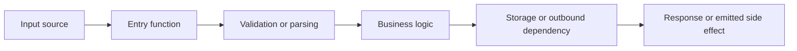

# Review Template

Use this template when the user wants a structured repo review deliverable.

## Scope Reviewed

- Repository or package:
- Focus area:
- Coverage level:
- Evidence quality:

## High-Level Data Flow

## Step-By-Step Function Review

### Step 1: [Name]

- File:
- Function:
- Purpose:
- Inputs:
- Outputs:
- Calls:
- Side effects:
- Validation:
- Trust boundary:
- Notes:

### Step 2: [Name]

- File:
- Function:
- Purpose:
- Inputs:
- Outputs:
- Calls:
- Side effects:
- Validation:
- Trust boundary:
- Notes:

## Findings

- Confirmed finding:
- Confirmed finding:

## Open Questions

- Open question:
- Open question:

## Search Prompts

Use searches like these to locate the main flow quickly:

- `rg "router|route|app\\.|express|fastify|gin|mux|handler|controller"`
- `rg "queue|consumer|worker|job|cron|schedule|webhook"`
- `rg "SELECT|INSERT|UPDATE|DELETE|findBy|save\\(|create\\(|fetch\\(|axios|http"`
- `rg "validate|schema|zod|joi|marshal|unmarshal|parse|decode|encode"`
